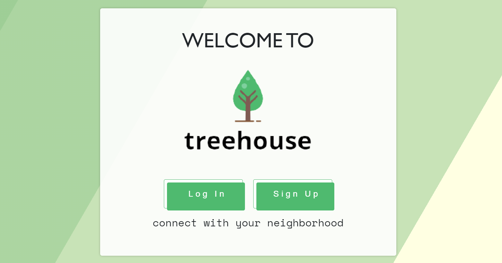
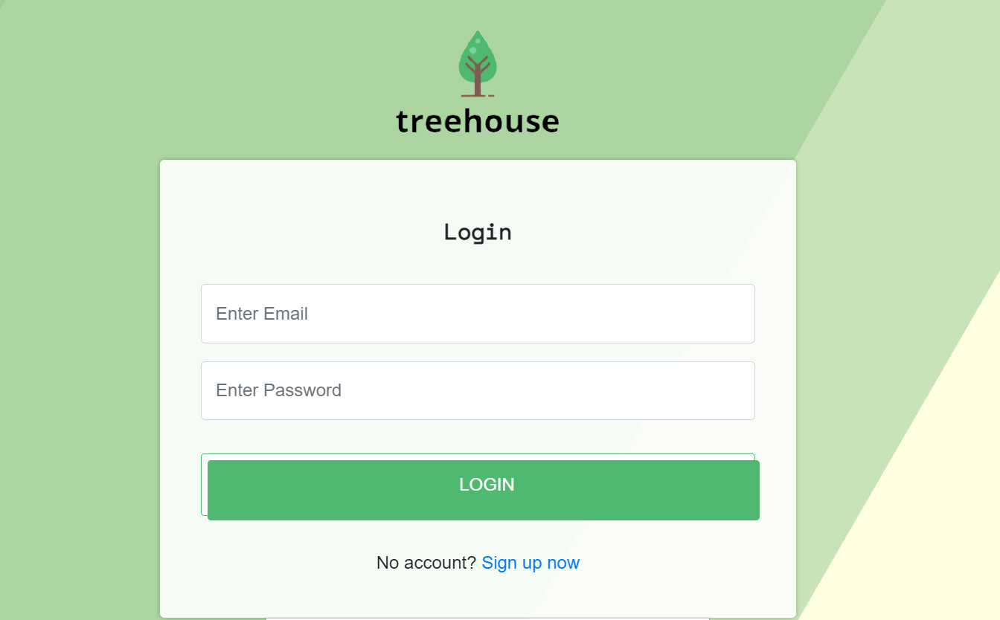
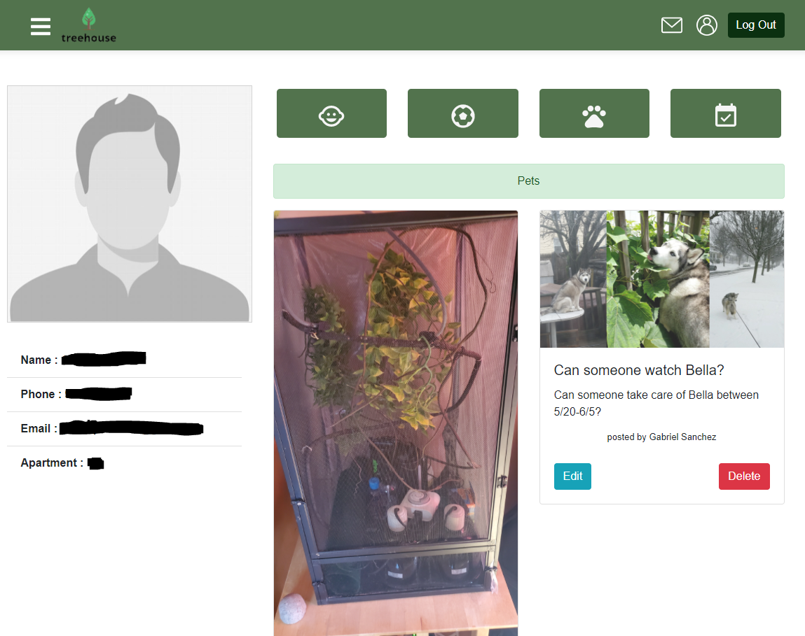
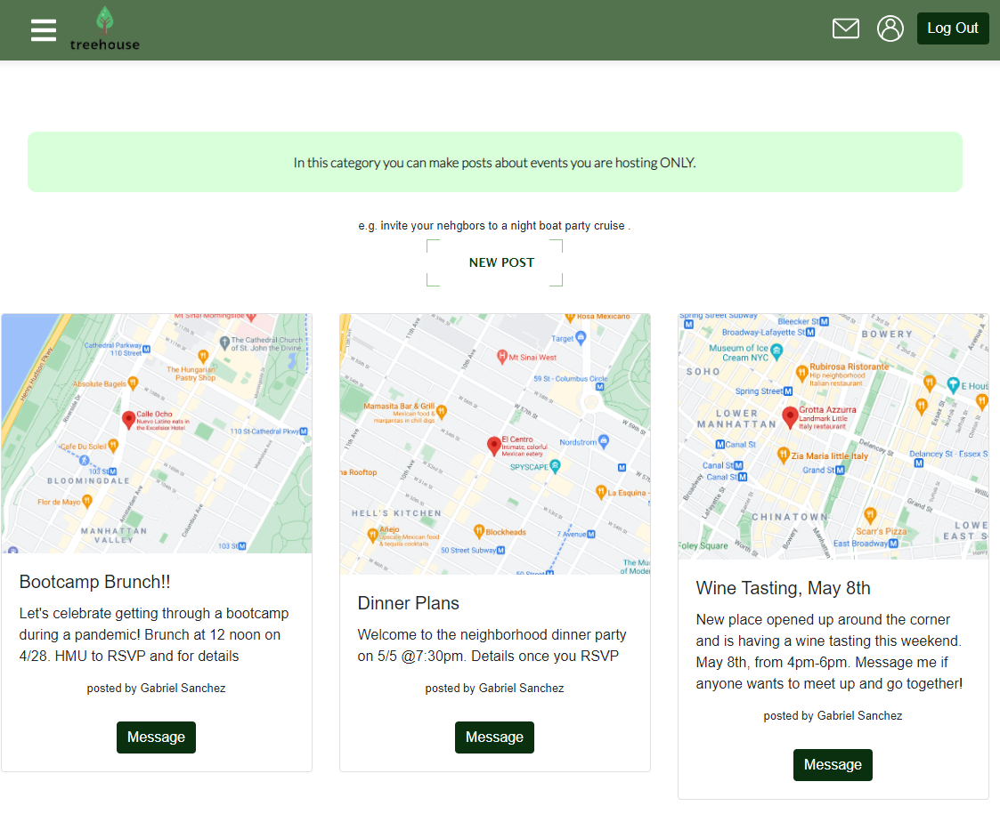

# Project_3

# TREEHOUSE_app

The TREEHOUSE app allows users to connect in a safer way with people in their apartment buildings/complex//neighborhood.

Deployed at: [Treehouse on Heroku](https://tree-house-app.herokuapp.com/)

Repo: [Github Repo for Treehouse](https://github.com/gabel35/tree-house)

# Description

The TREEHOUSE was created to help people in the neighborhood to connect in an easy and safe way. The app allows users to create an account and make posts and see others' posts and contact other users. If a user has a dog, they can make a new post asking if someone is available to watch the dog, while the user is out of town. If a user wants to sell or is looking to buy a used item, they also can make a post about it. If somene want to throw a party or invite kids to a Birthday party, they also can do it in a special category.
Users also can attach a photo to their posts, edit or delete it.

## Table of Contents

- [User-Story](#User-Story)
- [Functionality](#Functionality)
- [Installation](#Installation)
- [Usage](#usage)
- [Screenshots](#Screenshots)
- [APIs](#APIs)
- [Division](#Division)

# User-Story
 
GIVEN that I would like to meet new people in my neighborhood.
 
AS a user who just moved to a new city/neighborhood I want to connect with new people and make new friends.
 
I WANT to connect with people with similar interests and/or needs. 
 
SO THAT I can make posts about upcoming events, asking for a favor or offering my help.
 

# Functionality

WHEN I open the App I can create a new account
 
THEN I am given a promt to provide information about myself to verify I am a resident  
WHEN I log in using my email and password
 
THEN I am redirected to my profile page.
 
WHEN I click on side navbar, I can navigate to different categories of the App.
  
THEN I am given an instruction and decide which category I would like to create my post in.
 
WHEN I choose a category
 
THEN I click "add new post" and will be given a form and be able to post it on the app.
 
WHEN I want to see other's listings I can switch between categories and also click on it to send an email to an author.
 
THEN I will be redirected to email.
 
WHEN I want to see all of my posts, I can to go my profile page and edit or delete them there. 
 

## Installation

1. Clone the repo and run `npm install` for the required dependencies. Run `npm start seed` in order to seed the database.

## Usage

Application will be invoked by using the `npm start` command in the terminal. Open `https://localhost:3000` in your browser.

# Screenshots

# Packages, APIs, and Technologies:

Technologies we used for the project:

- react-dom
- react-icons
- react-images-uploading
- Sequalize
- MySQL12
- express
- express-session
- axios
- bcrypt-nodejs
- jsonwebtoken
- passport
- http-proxy-middleware
 

# APIs:

# Division:

- Jacquelin - Back-end - @jacquelinerodney
- Gabriel - Back-end - @Gabel35
- Kristina- Front-end - @kiankovskaia
- Jude - Front-end - @Jude626
